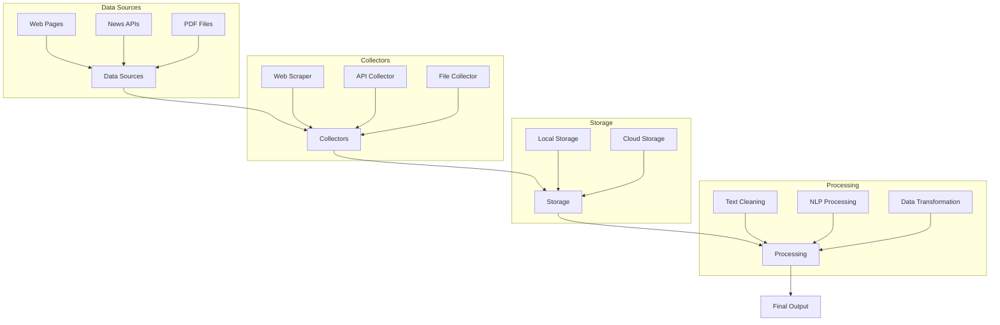
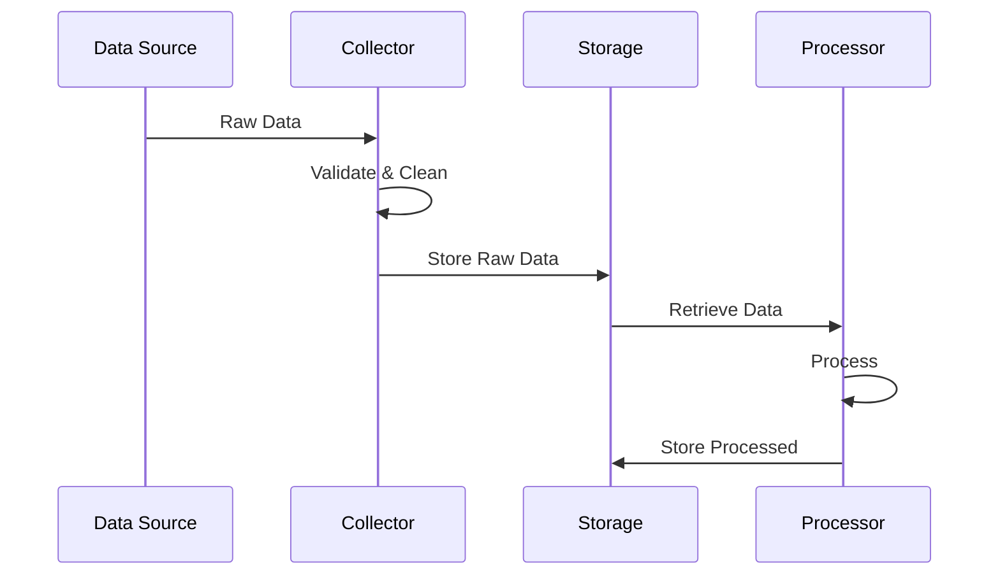
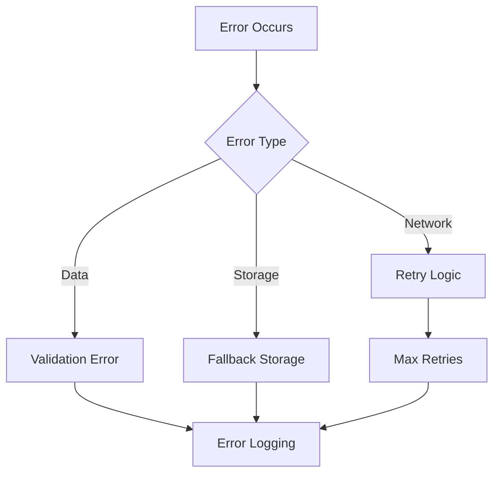

# NLP Data Pipeline Architecture

## High-Level Architecture


## Project Structure
```
nlp_data_pipeline/
├── src/                      # Source code
│   ├── collectors/          # Data collection modules
│   │   ├── api/            # API-based collectors
│   │   ├── web/            # Web scrapers
│   │   └── file/           # File-based collectors
│   ├── storage/            # Storage implementations
│   │   ├── local/          # Local file system storage
│   │   └── gcs/            # Google Cloud Storage
│   └── processing/         # Data processing modules
├── config/                  # Configuration files
├── examples/               # Example implementations
├── tests/                  # Test cases
└── data/                   # Local data storage
```

## Component Details

### 1. Base Classes and Interfaces

#### BaseCollector (`src/collectors/base.py`)
```python
class BaseCollector:
    def collect_data()  # Abstract method for data collection
    def validate_data() # Data validation
    def preprocess()    # Initial data cleaning
```

#### BaseStorage (`src/storage/base.py`)
```python
class BaseStorage:
    def save()         # Save data
    def load()         # Load data
    def delete()       # Delete data
    def list()         # List stored data
```

### 2. Data Collection Layer

#### Web Scraping (`src/collectors/web/`)
- NewsScraper: Scrapes news websites
- Handles pagination, authentication
- Extracts structured data

#### API Collection (`src/collectors/api/`)
- NewsAPICollector: Collects from News APIs
- RESTCollector: Generic REST API handling
- Manages rate limiting, authentication

#### File Collection (`src/collectors/file/`)
- PDFCollector: Extracts text from PDFs
- Handles different file formats

### 3. Storage Layer

#### Local Storage (`src/storage/local/`)
- File system based storage
- Supports multiple formats (JSON, CSV, Pickle)
- Organized directory structure

#### Cloud Storage (`src/storage/gcs/`)
- Google Cloud Storage integration
- Bucket management
- Cloud-specific optimizations

### 4. Configuration Management

#### YAML Configuration (`config/`)
```yaml
# data_collectors_config.yaml
collectors:
  news_api:
    base_url: "https://api.example.com"
    rate_limit: 100
    timeout: 30

# storage_config.yaml
storage:
  local:
    base_path: "data/"
    formats: ["json", "csv"]
  cloud:
    bucket: "my-bucket"
    project: "my-project"
```

## Data Flow



## Implementation Examples

### 1. Basic Web Scraping
```python
scraper = NewsScraper()
storage = LocalStorage()

# Collect and store
data = scraper.collect_data(urls)
storage.save_json(data)
```

### 2. API Collection with Processing
```python
collector = NewsAPICollector()
processor = TextProcessor()
storage = CloudStorage()

# Collect, process, store
raw_data = collector.collect_data()
processed = processor.process(raw_data)
storage.save(processed)
```

## Configuration Details

### 1. Collector Configuration
- API endpoints and keys
- Rate limiting settings
- Timeout configurations
- Retry policies

### 2. Storage Configuration
- Storage paths and formats
- Cloud credentials
- Compression settings
- Backup policies

## Error Handling



## Monitoring and Logging

### 1. Performance Metrics
- Collection speed
- Storage usage
- Processing time
- Success rates

### 2. Error Tracking
- Error types and frequencies
- Retry attempts
- Data quality issues

## Security Considerations

### 1. Data Protection
- Encryption at rest
- Secure transmission
- Access control

### 2. API Security
- Key management
- Rate limiting
- Request validation

## Extension Points

### 1. New Collectors
- Additional API sources
- Different file formats
- Custom web scrapers

### 2. Storage Options
- Different databases
- Cloud providers
- Caching layers

### 3. Processors
- Custom NLP models
- Data transformations
- Export formats

## Best Practices

### 1. Code Organization
- Modular design
- Clear interfaces
- Consistent naming

### 2. Error Handling
- Graceful degradation
- Comprehensive logging
- Clear error messages

### 3. Configuration
- Environment-based
- Externalized configs
- Secure credentials

## Testing Strategy

### 1. Unit Tests
- Individual components
- Mock external services
- Edge cases

### 2. Integration Tests
- Component interaction
- End-to-end flows
- Performance testing

## Deployment

### 1. Local Development
```bash
# Setup
python -m venv venv
source venv/bin/activate
pip install -r requirements.txt

# Run
python -m nlp_data_pipeline.examples.local_example
```

### 2. Cloud Deployment
- Container support
- Cloud Functions
- Scheduled jobs

## Future Enhancements

1. **Additional Features**
   - Real-time processing
   - Distributed collection
   - Advanced NLP

2. **Scalability**
   - Horizontal scaling
   - Load balancing
   - Caching layers

3. **Integration**
   - More data sources
   - Export formats
   - Analysis tools 